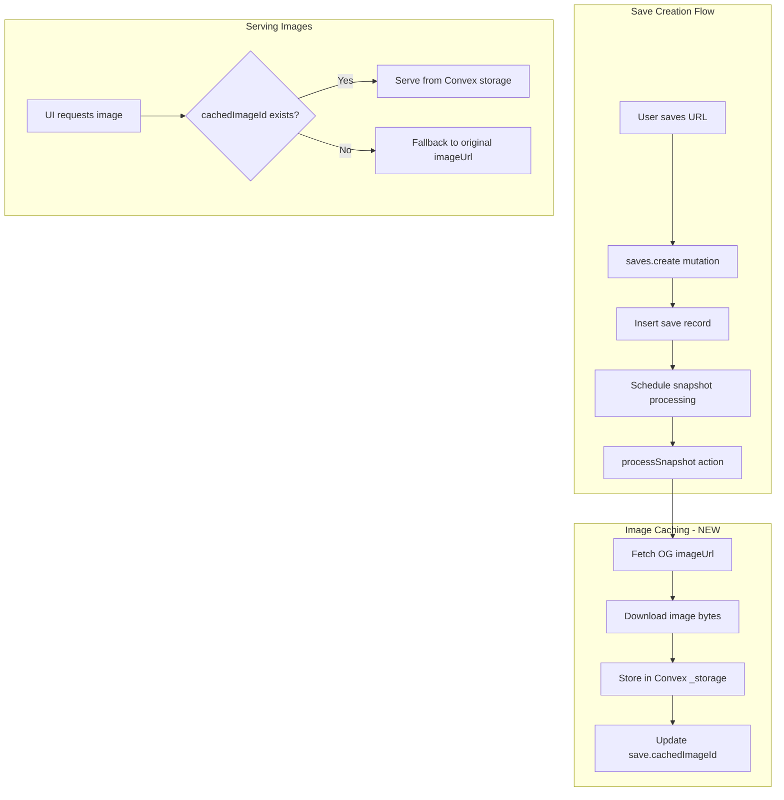

# Cache OG Images at Save Time

## Architecture



## Changes Overview

| File | Change |

|------|--------|

| [`convex/schema.ts`](convex/schema.ts) | Add `cachedImageStorageId` field to saves table |

| [`convex/lib/snapshot_processor.ts`](convex/lib/snapshot_processor.ts) | Add image download logic after fetching metadata |

| [`convex/saves.ts`](convex/saves.ts) | Add query to get cached image URL, update `updateSaveMetadata` |

| [`apps/backpocket-web/app/app/saves/page.tsx`](apps/backpocket-web/app/app/saves/page.tsx) | Use cached image URL with fallback |

---

## Implementation Details

### 1. Schema Change

Add a new field to the `saves` table:

```typescript
// convex/schema.ts
saves: defineTable({
  // ... existing fields
  cachedImageStorageId: v.optional(v.id("_storage")), // NEW
})
```

### 2. Image Caching Logic

Add to the snapshot processor after extracting metadata:

```typescript
// convex/lib/snapshot_processor.ts
// After getting imageUrl, download and store it
if (imageUrl) {
  try {
    const response = await fetch(imageUrl, {
      headers: { "User-Agent": "Backpocket/1.0" },
      signal: AbortSignal.timeout(10000),
    });
    
    if (response.ok && response.headers.get("content-type")?.startsWith("image/")) {
      const blob = await response.blob();
      const storageId = await ctx.storage.store(blob);
      await ctx.runMutation(internal.saves.updateCachedImage, {
        saveId: args.saveId,
        cachedImageStorageId: storageId,
      });
    }
  } catch (e) {
    // Log but don't fail - original imageUrl still works as fallback
    console.warn("[snapshots] Failed to cache image:", e);
  }
}
```

### 3. Serving Cached Images

Add a query to get the cached image URL:

```typescript
// convex/saves.ts
export const getCachedImageUrl = query({
  args: { storageId: v.id("_storage") },
  handler: async (ctx, args) => {
    return await ctx.storage.getUrl(args.storageId);
  },
});
```

### 4. UI Integration

Update the Image components to prefer cached images:

```tsx
// In save list/grid components
const imageUrl = save.cachedImageUrl ?? save.imageUrl;
```

The `cachedImageUrl` will be resolved from the storage ID in the query that returns saves.

### 5. Migration for Existing Saves

Create a one-time migration action to backfill images for existing saves:

```typescript
// convex/migrations/cache_existing_images.ts
export const cacheExistingImages = internalAction({
  handler: async (ctx) => {
    // Get saves with imageUrl but no cachedImageStorageId
    // Process in batches to avoid timeout
  },
});
```

---

## Cost Estimate

| Saves | Image Size | Storage | Convex Cost |

|-------|------------|---------|-------------|

| 1,000 | 100KB avg | ~100MB | ~$0.50/mo |

| 10,000 | 100KB avg | ~1GB | ~$5/mo |

| 50,000 | 100KB avg | ~5GB | ~$25/mo |

Convex File Storage: $0.50/GB/month for storage, $0.10/GB egress.

---

## Fallback Strategy

1. Always try `cachedImageUrl` first (served from Convex CDN)
2. Fall back to `imageUrl` if cached version doesn't exist
3. Show placeholder if both fail

This ensures zero breaking changes for existing saves.