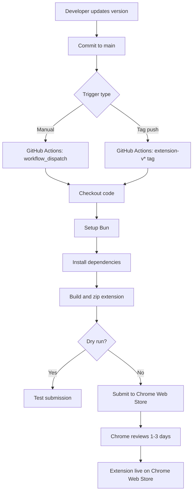

# Chrome Web Store Release and CI/CD Setup

## Current State

Your extension is already well-prepared for publishing:

- **Framework**: WXT v0.20.13 with React
- **Version**: 1.0.0 (in `package.json`)
- **Build scripts**: `bun run zip` creates store-ready ZIP files
- **Documentation**: [docs/DEPLOY-EXTENSION.md](docs/DEPLOY-EXTENSION.md) already has detailed steps
- **No GitHub Actions**: Root `.github/` folder doesn't exist yet

## Phase 1: Initial Chrome Web Store Submission (Manual)

First-time publishing must be done manually - WXT's `submit` command only updates existing listings.

### 1.1 Create Developer Account

- Register at [Chrome Web Store Developer Dashboard](https://chrome.google.com/webstore/devconsole/)
- Pay one-time $5 registration fee

### 1.2 Prepare Store Assets

Required assets to create/gather:

- **Screenshots**: 1280x800 or 640x400 (at least 1, up to 5)
- **Promotional tile**: 440x280 (optional but recommended)
- **Privacy policy URL**: Required for extensions requesting permissions
- **Description**: Short and detailed descriptions
- **Category**: Productivity

Icons already exist in `apps/backpocket-browser-extension/public/icon/`:

- 16.png, 32.png, 48.png, 96.png, 128.png

### 1.3 Build and Upload

```bash
cd apps/backpocket-browser-extension
bun run zip
# Creates: .output/backpocket-browser-extension-1.0.0-chrome.zip
```

Upload this ZIP to Chrome Web Store Developer Dashboard and submit for review (typically 1-3 days).

---

## Phase 2: Set Up API Credentials for Automation

After the initial manual submission, set up credentials for CI/CD.

### 2.1 Google Cloud Console Setup

1. Go to [Google Cloud Console](https://console.cloud.google.com/)
2. Create a new project (e.g., "Backpocket Extension Publishing")
3. Enable the **Chrome Web Store API**
4. Go to APIs and Services -> Credentials
5. Create **OAuth 2.0 Client ID** (Desktop application type)
6. Download the client ID and client secret

### 2.2 Get Refresh Token

Use `chrome-webstore-upload-cli` to complete OAuth flow:

```bash
bunx chrome-webstore-upload-cli init
# Follow prompts to authorize and get refresh token
```

### 2.3 Collect Required Secrets

You'll need these 4 values for GitHub Secrets:

| Secret | Where to find it |

| ---------------------- | --------------------------------------------- |

| `CHROME_EXTENSION_ID` | From your extension's Chrome Web Store URL |

| `CHROME_CLIENT_ID` | Google Cloud Console -> OAuth credentials |

| `CHROME_CLIENT_SECRET` | Google Cloud Console -> OAuth credentials |

| `CHROME_REFRESH_TOKEN` | From `chrome-webstore-upload-cli init` output |

---

## Phase 3: Create GitHub Actions Workflow

### 3.1 Create Workflow File

Create `.github/workflows/extension-release.yml` at the repository root:

```yaml
name: Release Extension

on:
  # Manual trigger with version input
  workflow_dispatch:
    inputs:
      version:
        description: "Version to release (e.g., 1.0.1)"
        required: false
        type: string
      dry_run:
        description: "Dry run (test without submitting)"
        required: false
        type: boolean
        default: false
  # Auto-trigger on extension version tags
  push:
    tags:
      - "extension-v*"

jobs:
  build-and-submit:
    runs-on: ubuntu-latest
    defaults:
      run:
        working-directory: apps/backpocket-browser-extension

    steps:
      - name: Checkout
        uses: actions/checkout@v4

      - name: Setup Bun
        uses: oven-sh/setup-bun@v2

      - name: Install dependencies
        run: bun install
        working-directory: .

      - name: Build and zip extension
        run: bun run zip

      - name: Submit to Chrome Web Store
        run: |
          FLAGS=""
          if [ "${{ inputs.dry_run }}" = "true" ]; then
            FLAGS="--dry-run"
          fi
          bunx wxt submit $FLAGS \
            --chrome-zip .output/*-chrome.zip
        env:
          CHROME_EXTENSION_ID: ${{ secrets.CHROME_EXTENSION_ID }}
          CHROME_CLIENT_ID: ${{ secrets.CHROME_CLIENT_ID }}
          CHROME_CLIENT_SECRET: ${{ secrets.CHROME_CLIENT_SECRET }}
          CHROME_REFRESH_TOKEN: ${{ secrets.CHROME_REFRESH_TOKEN }}

      - name: Upload artifacts
        uses: actions/upload-artifact@v4
        with:
          name: extension-build
          path: apps/backpocket-browser-extension/.output/*.zip
          retention-days: 30
```

### 3.2 Add GitHub Secrets

Go to your repository Settings -> Secrets and variables -> Actions, then add:

- `CHROME_EXTENSION_ID`
- `CHROME_CLIENT_ID`
- `CHROME_CLIENT_SECRET`
- `CHROME_REFRESH_TOKEN`

---

## Phase 4: Release Process

### Option A: Manual Trigger (Recommended for now)

1. Update version in `apps/backpocket-browser-extension/package.json`
2. Commit the change
3. Go to GitHub Actions -> Release Extension -> Run workflow
4. Optionally check "Dry run" first to test

### Option B: Tag-Based Trigger

1. Update version in `package.json`
2. Commit and push
3. Create and push a tag:
   ```bash
   git tag extension-v1.0.1
   git push origin extension-v1.0.1
   ```

---

## Future Enhancements (Optional)

### Add Firefox Support

Add Firefox credentials and update the workflow:

- `FIREFOX_EXTENSION_ID`
- `FIREFOX_JWT_ISSUER`
- `FIREFOX_JWT_SECRET`

Then modify the submit command:

```bash
bunx wxt submit \
  --chrome-zip .output/*-chrome.zip \
  --firefox-zip .output/*-firefox.zip \
  --firefox-sources-zip .output/*-sources.zip
```

### Add Edge Support

Edge accepts Chrome extensions, so you can add:

- `EDGE_PRODUCT_ID`
- `EDGE_CLIENT_ID`
- `EDGE_CLIENT_SECRET`
- `EDGE_ACCESS_TOKEN_URL`

### Automated Version Bumping

Consider adding a step to automatically bump versions using `bun version patch/minor/major` before building.

---

## Files to Create/Modify

| File | Action |

| ------------------------------------------------ | ------------------------- |

| `.github/workflows/extension-release.yml` | Create (new) |

| `apps/backpocket-browser-extension/package.json` | Bump version for releases |

## Diagram: Release Flow


