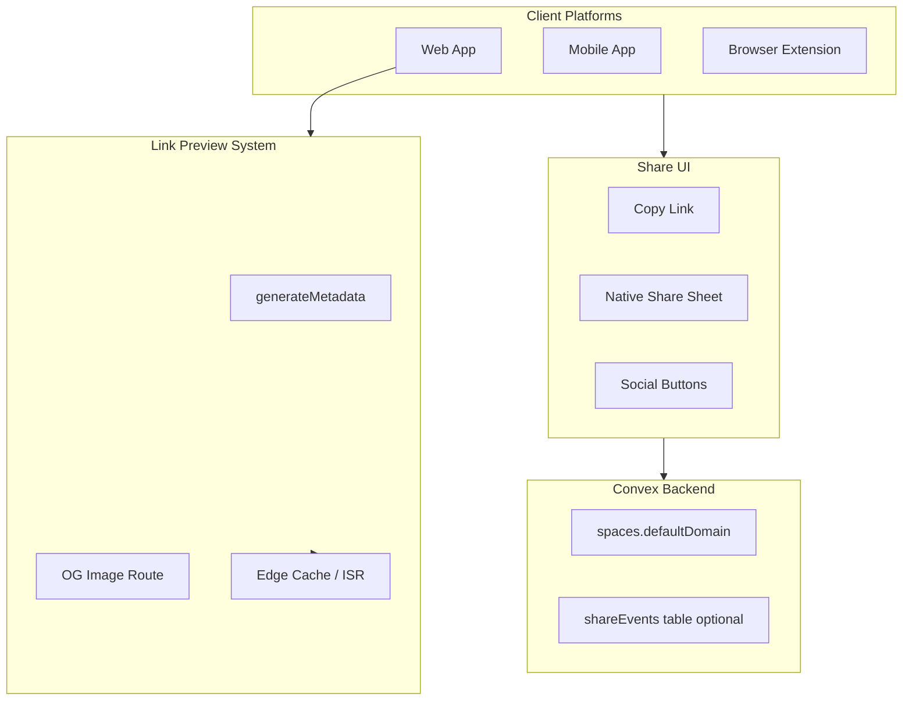

# Share Feature Implementation Plan

## Current State

Your architecture already has solid foundations:

- **Public saves** accessible at `{slug}.backpocket.my/s/{saveId}` or `{custom-domain}/s/{saveId}`
- **Domain mappings** table tracks custom domains per space
- **Settings sync** pattern exists (e.g., `defaultSaveVisibility` syncs to Convex via `spaces` table)
- **Public queries** in [`convex/public.ts`](convex/public.ts) handle unauthenticated access
- Save metadata available: `title`, `description`, `imageUrl`, `siteName`

**Key gaps:**

1. No share UI on any platform
2. No OG images or dynamic metadata for individual saves
3. No setting to specify preferred share domain

---

## Architecture Overview



---

## 1. Default Domain Setting

**Problem:** Users can have multiple domains (subdomain + custom domains). Which domain should be used as the canonical/primary one?

**Solution:** Add `defaultDomain` field to the `spaces` table.

**Schema change** in [`convex/schema.ts`](convex/schema.ts):

```typescript
spaces: defineTable({
  // ... existing fields
  defaultDomain: v.optional(v.string()), // null = use subdomain, or "custom:domain.com"
})
```

**Value format:**

- `null` or `undefined` - use subdomain (`{slug}.backpocket.my`)
- `"custom:mario.example.com"` - use specific custom domain

**Use cases:**

- Share URLs (primary use case for this feature)
- Display in web app UI (footer/corner)
- Email notifications with links
- Any future feature needing "the user's preferred domain"

**API update** in [`convex/spaces.ts`](convex/spaces.ts):

- Add `defaultDomain` to `updateSettings` mutation
- Return in `getMySpace` query

**UI placement:**

- Web: Settings page, "Public Space" section (already exists)
- Mobile: `app/settings/public-space.tsx`
- Extension: Not needed (reads from account)

**Display in UI:**

- Web: Show selected domain in footer/corner as you mentioned
- Mobile: Show in public space settings

---

## 2. Share URL Generation

Create a shared utility for generating share URLs:

**New file:** [`packages/utils/src/share.ts`](packages/utils/src/share.ts)

```typescript
export interface ShareUrlOptions {
  saveId: string;
  spaceSlug: string;
  defaultDomain: string | null;
  rootDomain?: string; // defaults to "backpocket.my"
}

export function getShareUrl(options: ShareUrlOptions): string {
  const { saveId, spaceSlug, defaultDomain, rootDomain = "backpocket.my" } = options;
  
  if (defaultDomain?.startsWith("custom:")) {
    const domain = defaultDomain.replace("custom:", "");
    return `https://${domain}/s/${saveId}`;
  }
  
  return `https://${spaceSlug}.${rootDomain}/s/${saveId}`;
}
```

---

## 3. Smart Link Previews (Branded OG Images + Metadata)

Generate branded OG images with backpocket branding for a professional, consistent appearance across all shared links.

**Approach:**

- If save has `imageUrl`: use as background with gradient overlay + title text
- If no image: generate a clean branded card with title on solid/gradient background
- Always include backpocket logo in corner for brand recognition

**Implementation:**

**New route:** `apps/backpocket-web/app/api/og/save/[saveId]/route.tsx`

```typescript
import { ImageResponse } from "@vercel/og";

export const runtime = "edge";

export async function GET(
  request: Request,
  { params }: { params: { saveId: string } }
) {
  const save = await getPublicSave(params.saveId);
  if (!save) return new Response("Not found", { status: 404 });

  // Load font for consistent typography
  const fontData = await fetch(new URL("./Inter-SemiBold.ttf", import.meta.url))
    .then((res) => res.arrayBuffer());

  // Prepare note for display (strip markdown, truncate)
  const notePreview = save.note 
    ? truncate(stripMarkdown(save.note), 120) 
    : null;

  return new ImageResponse(
    <div
      style={{
        width: "100%",
        height: "100%",
        display: "flex",
        flexDirection: "column",
        justifyContent: "flex-end",
        padding: 60,
        background: save.imageUrl
          ? `linear-gradient(to top, rgba(0,0,0,0.85), rgba(0,0,0,0.4)), url(${save.imageUrl})`
          : "linear-gradient(135deg, #1a1a2e 0%, #16213e 100%)",
        backgroundSize: "cover",
        backgroundPosition: "center",
      }}
    >
      {/* Site name / source */}
      <div style={{ color: "#a0a0a0", fontSize: 24, marginBottom: 12 }}>
        {save.siteName || new URL(save.url).hostname}
      </div>
      
      {/* Title */}
      <div
        style={{
          color: "#ffffff",
          fontSize: notePreview ? 40 : 48, // Slightly smaller if showing note
          fontWeight: 600,
          lineHeight: 1.2,
          maxWidth: "90%",
          marginBottom: notePreview ? 16 : 0,
        }}
      >
        {truncate(save.title || "Untitled", 80)}
      </div>
      
      {/* User's note - shown if exists */}
      {notePreview && (
        <div
          style={{
            display: "flex",
            alignItems: "flex-start",
            gap: 12,
            marginTop: 8,
          }}
        >
          <span style={{ color: "#6b7280", fontSize: 28 }}>"</span>
          <div
            style={{
              color: "#d1d5db",
              fontSize: 24,
              fontStyle: "italic",
              lineHeight: 1.4,
              maxWidth: "85%",
            }}
          >
            {notePreview}
          </div>
        </div>
      )}
      
      {/* Backpocket branding - bottom right */}
      <div
        style={{
          position: "absolute",
          bottom: 30,
          right: 40,
          display: "flex",
          alignItems: "center",
          gap: 8,
        }}
      >
        
        <span style={{ color: "#888", fontSize: 16 }}>backpocket</span>
      </div>
    </div>,
    {
      width: 1200,
      height: 630,
      fonts: [{ name: "Inter", data: fontData, style: "normal", weight: 600 }],
    }
  );
}
```

**Design considerations:**

- **1200x630px** - Standard OG image size (works for Twitter, Facebook, LinkedIn, etc.)
- **Dark theme** - Works well with or without background image
- **Gradient overlay** - Ensures text readability when using save's image as background
- **Inter font** - Clean, modern, matches backpocket brand
- **Subtle branding** - Logo in corner, not overwhelming

**Add metadata** to [`apps/backpocket-web/app/public/s/[saveId]/page.tsx`](apps/backpocket-web/app/public/s/[saveId]/page.tsx):

```typescript
export async function generateMetadata({ params }): Promise<Metadata> {
  const save = await getPublicSave(params.saveId);
  if (!save) return { title: "Not Found" };

  // Prioritize user's note over scraped description
  // Notes add personal context that makes shares more meaningful
  const description = save.note 
    ? truncate(stripMarkdown(save.note), 200)  // User's note (strip markdown for plain text)
    : save.description;                         // Fallback to scraped description

  return {
    title: save.title,
    description,
    openGraph: {
      title: save.title,
      description,
      images: [`/api/og/save/${params.saveId}`],
      type: "article",
    },
    twitter: {
      card: "summary_large_image",
      title: save.title,
      description,
      images: [`/api/og/save/${params.saveId}`],
    },
  };
}

// Helper to strip markdown for clean preview text
function stripMarkdown(text: string): string {
  return text
    .replace(/[#*_~`>\[\]()!]/g, '')  // Remove markdown syntax
    .replace(/\n+/g, ' ')              // Collapse newlines to spaces
    .trim();
}

function truncate(text: string, maxLength: number): string {
  if (text.length <= maxLength) return text;
  return text.slice(0, maxLength - 3) + '...';
}
```

**Caching strategy (Edge Cache, not ISR):**

- Set `Cache-Control: public, s-maxage=86400, stale-while-revalidate=604800`
- 24 hours fresh cache, 7 days stale-while-revalidate
- No manual invalidation needed - cache expires naturally
- See Section 7 for cost analysis (edge caching is 50-70x cheaper than ISR)

### oEmbed for Slack & Discord

Beyond OG tags, add oEmbed support for richer embeds in Slack, Discord, and other platforms.

**What oEmbed adds:**

- Author attribution ("Saved by mario" with link to their space)
- Provider branding ("Backpocket" with logo)
- Theme color (Discord sidebar color)

**1. oEmbed Discovery Tag** - Add to public save page metadata:

```typescript
// In generateMetadata for /public/s/[saveId]/page.tsx
return {
  // ... existing metadata
  alternates: {
    types: {
      "application/json+oembed": `/api/oembed?url=${encodeURIComponent(canonicalUrl)}`,
    },
  },
  other: {
    "theme-color": "#3B82F6", // Backpocket brand color for Discord
  },
};
```

**2. oEmbed API Endpoint** - New route at `apps/backpocket-web/app/api/oembed/route.ts`:

```typescript
export async function GET(request: Request) {
  const { searchParams } = new URL(request.url);
  const url = searchParams.get("url");
  
  if (!url) {
    return Response.json({ error: "Missing url parameter" }, { status: 400 });
  }

  // Parse saveId from URL (e.g., https://mario.backpocket.my/s/abc123)
  const saveId = extractSaveIdFromUrl(url);
  if (!saveId) {
    return Response.json({ error: "Invalid URL" }, { status: 400 });
  }

  const save = await getPublicSave(saveId);
  if (!save) {
    return Response.json({ error: "Not found" }, { status: 404 });
  }

  const space = await getPublicSpace(save.spaceId);

  return Response.json({
    version: "1.0",
    type: "link",
    title: save.title || "Untitled",
    description: save.note 
      ? truncate(stripMarkdown(save.note), 200) 
      : save.description,
    author_name: space?.name || space?.slug,
    author_url: `https://${space?.slug}.backpocket.my`,
    provider_name: "Backpocket",
    provider_url: "https://backpocket.my",
    thumbnail_url: `https://backpocket.my/api/og/save/${saveId}`,
    thumbnail_width: 1200,
    thumbnail_height: 630,
  }, {
    headers: {
      "Cache-Control": "public, s-maxage=86400, stale-while-revalidate=604800",
    },
  });
}
```

**Slack & Discord behavior:**

- Both platforms check OG tags first (already covered)
- oEmbed provides fallback + richer data (author, provider)
- Theme color adds the colored sidebar in Discord embeds

---

## 4. Share UI Components

### Web App

**Add share button to save cards** in saves list and save detail:

- Primary action: Copy link (most common)
- Dropdown: Twitter, Facebook, LinkedIn, Email, Native Share API (if supported)

**Component location:** `apps/backpocket-web/components/share-button.tsx`

```typescript
export function ShareButton({ save, space }: ShareButtonProps) {
  const shareUrl = getShareUrl({
    saveId: save.id,
    spaceSlug: space.slug,
    defaultDomain: space.defaultDomain,
  });

  return (
    <DropdownMenu>
      <DropdownMenuTrigger>
        <ShareIcon />
      </DropdownMenuTrigger>
      <DropdownMenuContent>
        <DropdownMenuItem onClick={() => copyToClipboard(shareUrl)}>
          Copy link
        </DropdownMenuItem>
        <DropdownMenuItem onClick={() => shareToTwitter(shareUrl, save.title)}>
          Share on Twitter
        </DropdownMenuItem>
        {/* ... more options */}
      </DropdownMenuContent>
    </DropdownMenu>
  );
}
```

### Mobile App

**Use React Native's Share API** in `apps/backpocket-mobile/`:

```typescript
import { Share } from "react-native";

const handleShare = async () => {
  await Share.share({
    message: save.title,
    url: shareUrl, // iOS uses this separately
  });
};
```

**Add share button to:**

- Save detail quick actions (alongside favorite, archive)
- Dashboard swipeable row actions

### Browser Extension

**Add copy link button** to:

- `QuickSaveView.tsx` - after successful save
- `RecentSaves.tsx` - on hover/click

### "Make Public to Share" Flow

When a user tries to share a private save, offer to make it public instead of just blocking.

**User Flow:**

```
User clicks Share on private save
         ↓
┌─────────────────────────────────┐
│  🔒 This save is private        │
│                                 │
│  Make it public to share with   │
│  others?                        │
│                                 │
│  Your note will also be visible │
│  in the link preview.           │
│                                 │
│  [Cancel]  [Make Public & Copy] │
└─────────────────────────────────┘
         ↓ (if confirmed)
1. Update save visibility to "public"
2. Copy share URL to clipboard
3. Show success toast: "Link copied! Save is now public."
```

**Implementation:**

**Web - Dialog component** in `apps/backpocket-web/components/make-public-dialog.tsx`:

```typescript
export function MakePublicDialog({ 
  save, 
  open, 
  onOpenChange, 
  onConfirm 
}: MakePublicDialogProps) {
  const updateSave = useUpdateSave();
  const [isPending, setIsPending] = useState(false);

  const handleConfirm = async () => {
    setIsPending(true);
    await updateSave({ id: save.id, visibility: "public" });
    onConfirm(); // Parent handles copy + toast
    onOpenChange(false);
  };

  return (
    <Dialog open={open} onOpenChange={onOpenChange}>
      <DialogContent>
        <DialogHeader>
          <DialogTitle>This save is private</DialogTitle>
          <DialogDescription>
            Make it public to share with others?
            {save.note && (
              <span className="block mt-2 text-amber-600 dark:text-amber-400">
                Your note will also be visible in the link preview.
              </span>
            )}
          </DialogDescription>
        </DialogHeader>
        <DialogFooter>
          <Button variant="outline" onClick={() => onOpenChange(false)}>
            Cancel
          </Button>
          <Button onClick={handleConfirm} disabled={isPending}>
            {isPending ? "Updating..." : "Make Public & Copy"}
          </Button>
        </DialogFooter>
      </DialogContent>
    </Dialog>
  );
}
```

**Updated ShareButton logic:**

```typescript
const handleShare = () => {
  if (save.visibility === "private") {
    setShowMakePublicDialog(true);
    return;
  }
  copyShareUrl();
};
```

**Mobile - Alert.alert():**

```typescript
const handleShare = () => {
  if (save.visibility === "private") {
    Alert.alert(
      "This save is private",
      save.note 
        ? "Make it public to share? Your note will also be visible."
        : "Make it public to share with others?",
      [
        { text: "Cancel", style: "cancel" },
        { 
          text: "Make Public & Share", 
          onPress: async () => {
            await updateSave({ id: save.id, visibility: "public" });
            await Share.share({ url: shareUrl, message: save.title });
          }
        },
      ]
    );
    return;
  }
  Share.share({ url: shareUrl, message: save.title });
};
```

**Extension** - Similar pattern with browser confirm or custom UI.

---

## 5. Privacy Considerations

**Only public saves should be shareable with previews:**

- If `space.visibility === "private"` or `save.visibility === "private"`, link leads to 404
- Show clear visibility indicator before sharing
- Consider: Show share button but with warning for private saves

**UI indication:**

- Public saves: Share button enabled, shows globe icon
- Private saves: Share button disabled or shows lock with tooltip "Make public to share"

### Privacy Policy Update

Update [`apps/backpocket-web/app/privacy/page.tsx`](apps/backpocket-web/app/privacy/page.tsx) to clarify that notes on public saves are visible in link previews.

**Changes to "Public Spaces" section:**

```diff
 <section>
   <h2>Public Spaces</h2>
   <p>
     If you choose to make your space or individual saves public, that
     content becomes visible to anyone with the URL. Public content
     includes:
   </p>
   <ul>
     <li>Your space name and bio</li>
-    <li>Saves you've marked as public (URL, title, description)</li>
+    <li>Saves you've marked as public (URL, title, description, and any notes you've added)</li>
     <li>Public collections and their contents</li>
     <li>A visitor counter showing total views</li>
+    <li>Link previews (images and descriptions) when you share links on social platforms</li>
   </ul>
   <p>
-    Private saves, notes, and private collections are{" "}
+    Private saves and private collections are{" "}
     <strong>never</strong> publicly visible.
+    Notes on private saves also remain private.
   </p>
 </section>
```

**Why this matters:**

- Current wording could be read as "notes are never publicly visible" (even on public saves)
- With the share feature, notes on public saves appear in OG images and metadata
- This clarification ensures users understand their notes will be visible when sharing

**Also update the "Last updated" date** at the top of the privacy policy.

---

## 6. Additional Considerations

### Share Analytics (Deferred)

> **Status:** Skipped for initial implementation. The existing `visitCounts` table on public spaces provides sufficient tracking. Revisit if granular share tracking becomes needed.

If needed in the future, could track which saves are shared and how:

```typescript
// Future: shareEvents table
shareEvents: defineTable({
  saveId: v.id("saves"),
  spaceId: v.id("spaces"),
  platform: v.string(), // "copy" | "twitter" | "facebook" | "native" | etc.
  timestamp: v.number(),
})
```

**Possible future enhancements:**

- UTM params on share URLs: `?utm_source=share&utm_medium={platform}`
- Parse UTM in visit tracking to attribute visits to shares
- Per-save view counts (currently only space-level)

### Collections/Tags Sharing

**Already possible** with current routes:

- Collection: `{domain}/?collection={name}`
- Tag: `{domain}/?tag={name}`

Consider adding dedicated short routes:

- `{domain}/c/{collection-slug}`
- `{domain}/t/{tag-name}`

### URL Slugs for SEO (Future)

Current: `{domain}/s/{saveId}`

Enhanced: `{domain}/s/{saveId}/{url-slug}`

Would require:

- Add `slug` field to saves (derived from title)
- Update routing
- Redirect from old URLs

### Short URLs (Future)

For easier sharing:

- `bpkt.my/{shortcode}` redirects to full URL
- Requires separate short domain + redirect service

---

## 7. Cost and Scalability

### ISR vs Edge Caching Analysis

**ISR is expensive for images:**

- ISR Reads: $0.40-0.64 per 1M read units (8KB each)
- ISR Writes: $4.00-6.40 per 1M write units
- OG images (100-200KB) = 12-25 units per image
- **1M views ≈ $15-25/month**

**Edge Caching is much cheaper:**

- Function Invocations: $0.60 per 1M
- Execution Units: $2.00 per 1M (50ms each)
- With 10% cache miss rate: **1M views ≈ $0.30/month**
- **50-70x cheaper than ISR**

### Recommended: Edge Caching with Cache-Control Headers

```typescript
// In OG route - apps/backpocket-web/app/api/og/save/[saveId]/route.tsx
export const runtime = "edge";

export async function GET(request: Request, { params }) {
  const save = await getPublicSave(params.saveId);
  if (!save) return new Response("Not found", { status: 404 });

  const imageResponse = new ImageResponse(/* ... */);
  
  // Set aggressive cache headers
  imageResponse.headers.set(
    "Cache-Control",
    "public, s-maxage=86400, stale-while-revalidate=604800"
  );
  // s-maxage=86400: Cache at edge for 24 hours
  // stale-while-revalidate=604800: Serve stale for 7 days while regenerating
  
  return imageResponse;
}
```

**Why this works for OG images:**

- OG images rarely change (save metadata is mostly static)
- Cache misses are fast (@vercel/og generates in 30-50ms)
- No persistence needed - regenerating on cache miss is fine
- Global edge distribution via Vercel CDN (100+ locations)

**Cache invalidation strategy:**

- Let cache expire naturally (24h fresh, 7d stale-while-revalidate)
- If save is updated, new OG image generates on next request
- No need for manual invalidation in most cases

**Convex Costs:**

- New queries are minimal (already doing public lookups)
- Share events table: Only if analytics needed, can be optional

---

## 8. Future Enhancements (Not in Initial Scope)

1. **Mobile deep links** - Consider universal links / app links so shared URLs open in mobile app if installed

2. **QR codes** - Quick share via QR, especially useful for mobile

3. **Share tokens for private saves** - Temporary/expiring links to share private saves without making them permanently public
   ```typescript
   shareTokens: defineTable({
     saveId: v.id("saves"),
     token: v.string(),
     expiresAt: v.number(),
     createdBy: v.string(),
   })
   ```

4. **Batch sharing** - Share multiple saves at once as a list/collection

5. **Preview before sharing** - Show how the link will appear (preview the OG card before copying)

---

## Implementation Order

**Phase 1: Foundation**

1. Add `defaultShareDomain` to schema and API
2. Create share URL utility
3. Add `generateMetadata` to public save page

**Phase 2: OG Images & oEmbed**

4. Create OG image generation route
5. Add caching headers
6. Create oEmbed API endpoint
7. Add oEmbed discovery tags and theme-color meta

**Phase 3: Share UI**

8. Web share button component
9. Mobile share integration
10. Extension copy link
11. "Make public to share?" dialog (web, mobile, extension)

**Phase 4: Settings UI**

12. Add default domain picker to settings
13. Display selected domain in web app footer

**Phase 5: Polish**

14. Update privacy policy (clarify notes on public saves visible in previews)
15. Testing across platforms and social media previews (Twitter, Facebook, Slack, Discord, LinkedIn, iMessage)