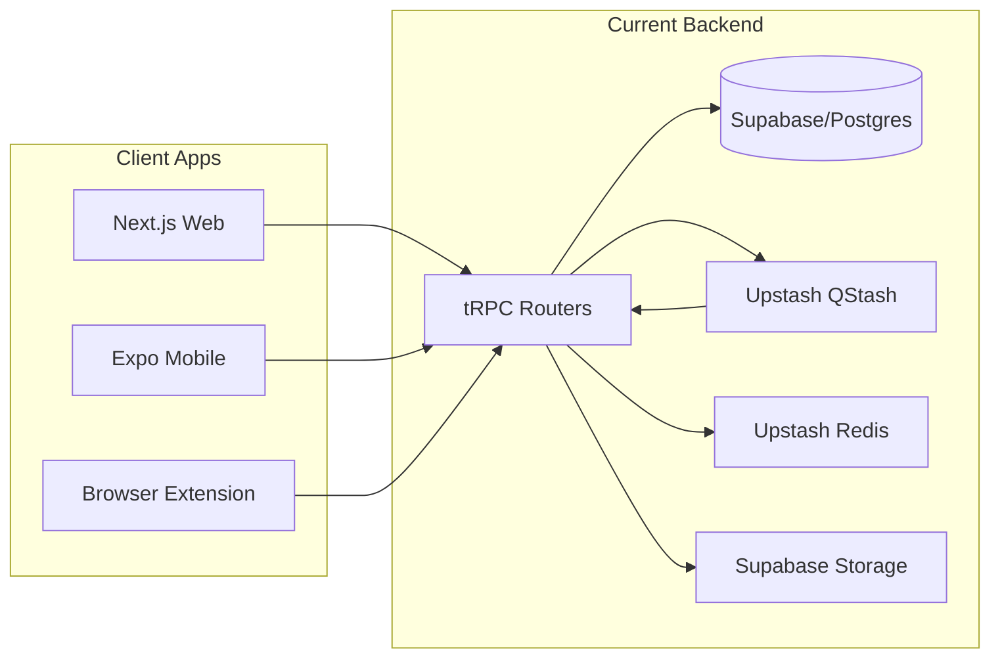
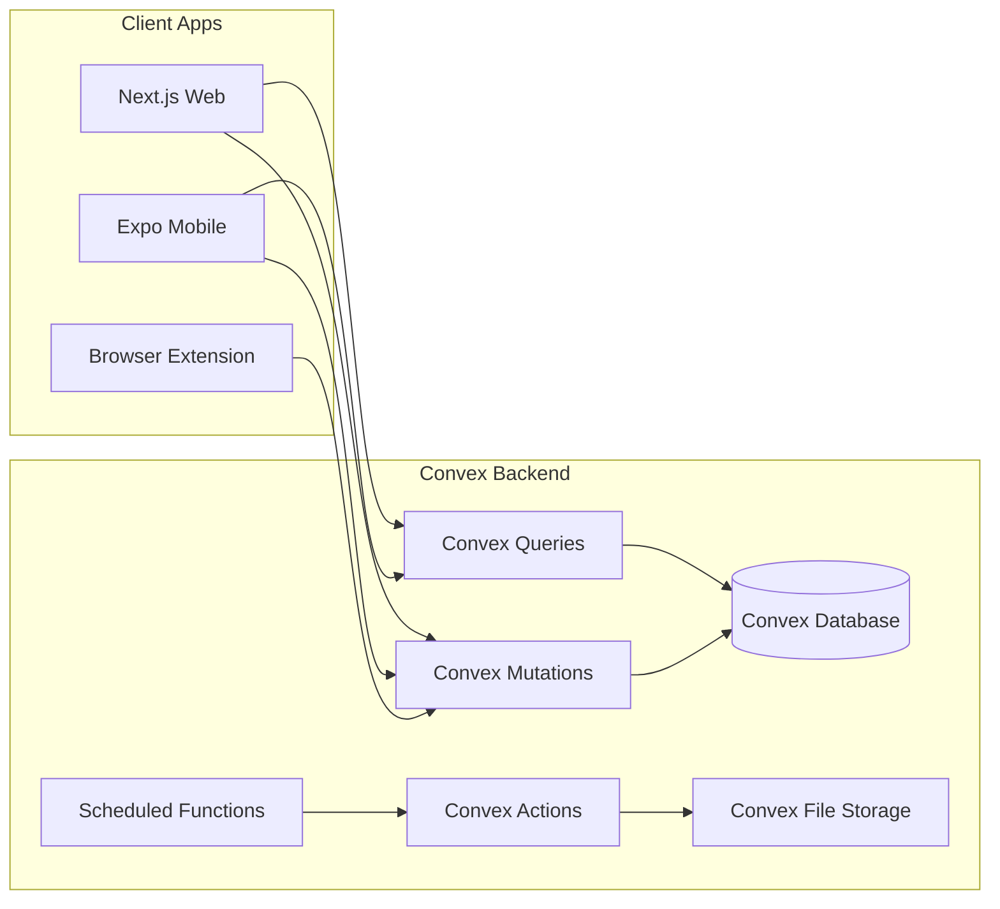

# Supabase to Convex Migration Plan

## Current Architecture



## Target Architecture



---

## Key Differences: Supabase vs Convex

| Aspect | Supabase (Current) | Convex (Target) |

|--------|-------------------|-----------------|

| Database | PostgreSQL with SQL | Document DB with TypeScript queries |

| IDs | UUIDs (`uuid_generate_v4()`) | Convex IDs (`v.id("tableName")`) |

| Relations | Foreign keys, JOIN queries | Document references, manual lookups |

| Auth | RLS policies | Function-level auth checks via `ctx.auth` |

| Real-time | Subscriptions (separate setup) | Built-in (all queries are reactive) |

| Background jobs | QStash + Redis | Scheduled functions + Actions |

| File storage | Supabase Storage buckets | Convex File Storage |

| API layer | tRPC routers | Convex functions (queries/mutations/actions) |

---

## Migration Phases

### Phase 1: Convex Setup and Schema Definition

1. **Initialize Convex in the monorepo**

   - Run `bunx convex init` in project root
   - Configure Clerk JWT integration in `convex/auth.config.ts`
   - Add `CONVEX_DEPLOYMENT` and `NEXT_PUBLIC_CONVEX_URL` env vars

2. **Define schema in `convex/schema.ts`** - translate the 10 Supabase tables:

| Supabase Table | Convex Table | Notes |

|---------------|--------------|-------|

| `spaces` | `spaces` | Add indexes on `slug` |

| `memberships` | `memberships` | Index on `userId`, `spaceId` |

| `saves` | `saves` | Indexes on `spaceId`, `savedAt`, `normalizedUrl` |

| `tags` | `tags` | Index on `spaceId` |

| `collections` | `collections` | Index on `spaceId` |

| `save_tags` | `saveTags` | Composite index on `saveId`, `tagId` |

| `save_collections` | `saveCollections` | Composite index |

| `save_snapshots` | `saveSnapshots` | Index on status for job processing |

| `domain_mappings` | `domainMappings` | Index on `domain` |

| `collection_default_tags` | `collectionDefaultTags` | Junction table |

1. **Create helper functions** in `convex/lib/`:

   - `auth.ts` - `getCurrentUser()`, `requireAuth()`, `getUserSpace()`
   - `validators.ts` - reusable validators for visibility, roles, etc.

### Phase 2: Convex Functions (Replace tRPC)

Map existing tRPC routers to Convex functions:

| tRPC Router | Convex Module | Key Functions |

|------------|---------------|---------------|

| [`saves.ts`](apps/backpocket-web/lib/trpc/routers/space/saves.ts) | `convex/saves.ts` | `list`, `get`, `create`, `update`, `delete`, `toggleFavorite`, `toggleArchive` |

| `tags.ts` | `convex/tags.ts` | `list`, `create`, `update`, `delete` |

| `collections.ts` | `convex/collections.ts` | `list`, `get`, `create`, `update`, `delete` |

| `settings.ts` | `convex/spaces.ts` | `get`, `update`, `updateVisibility` |

| `public.ts` | `convex/public.ts` | Public queries (no auth required) |

| `snapshots.ts` | `convex/snapshots.ts` | `get`, `getContent` + scheduled processing |

Key implementation patterns:

- Use `ctx.auth.getUserIdentity()` for authentication (replaces Clerk token verification in tRPC context)
- Use `ctx.db.query("table").withIndex()` for filtered queries (replaces Supabase `.eq()` chains)
- Replace Supabase joins with manual document lookups or denormalization

### Phase 3: Background Jobs (Replace QStash + Redis)

Replace the snapshot processing pipeline:

| Current | Convex Replacement |

|---------|-------------------|

| QStash message queue | `ctx.scheduler.runAfter()` |

| Redis rate limiting | Convex table + queries |

| Redis domain politeness | Scheduled function delays |

| Supabase Storage | Convex File Storage |

Create `convex/jobs/snapshots.ts`:

- `scheduleSnapshot` - mutation to queue processing
- `processSnapshot` - action to fetch and parse content (uses Node.js runtime for external HTTP)
- `retrySnapshot` - scheduled retry with exponential backoff

### Phase 4: Client Updates

#### Web App (`apps/backpocket-web/`)

1. **Add Convex provider** - wrap app in `ConvexProviderWithClerk`
2. **Replace React Query hooks** with Convex hooks:

   - `useQuery(api.saves.list, { spaceId })` replaces `useListSaves()`
   - `useMutation(api.saves.create)` replaces `useCreateSave()`
   - Remove React Query entirely (Convex handles caching + real-time)

3. **Update components** - change from tRPC patterns to Convex patterns
4. **Remove tRPC infrastructure** - delete `lib/trpc/` directory

#### Mobile App (`apps/backpocket-mobile/`)

1. **Add Convex provider** in [`_layout.tsx`](apps/backpocket-mobile/app/_layout.tsx)
2. **Replace API client** - remove [`client.ts`](apps/backpocket-mobile/lib/api/client.ts), use Convex directly
3. **Update hooks** - migrate from React Query + fetch to Convex hooks

#### Browser Extension (`apps/backpocket-browser-extension/`)

1. **Use ConvexHttpClient** for popup (non-reactive, simpler)
2. **Update [`api.ts`](apps/backpocket-browser-extension/lib/api.ts)** to call Convex mutations directly

### Phase 5: Cleanup

1. Remove Supabase dependencies and configuration
2. Remove tRPC packages and routers
3. Remove QStash and Redis configuration
4. Update environment variables documentation
5. Update [`PRODUCT-SPEC.md`](docs/PRODUCT-SPEC.md) with new Convex architecture

---

## Files to Create

```
convex/
├── _generated/          # Auto-generated by Convex
├── schema.ts            # Database schema
├── auth.config.ts       # Clerk JWT configuration
├── lib/
│   ├── auth.ts          # Auth helpers
│   └── validators.ts    # Shared validators
├── saves.ts             # Save queries/mutations
├── tags.ts              # Tag queries/mutations
├── collections.ts       # Collection queries/mutations
├── spaces.ts            # Space queries/mutations
├── public.ts            # Public (unauthenticated) queries
├── snapshots.ts         # Snapshot queries/actions
├── http.ts              # HTTP endpoints (if needed)
└── crons.ts             # Scheduled jobs
```

---

## Risk Considerations

1. **No SQL JOINs** - Convex requires manual lookups for related data; may need denormalization for performance
2. **ID format change** - Convex uses its own ID format, not UUIDs; affects any external integrations
3. **Real-time by default** - All queries subscribe; ensure this doesn't cause unexpected behavior
4. **Action limitations** - External HTTP calls must be in actions (not queries/mutations)

---

## Estimated Effort

| Phase | Effort |

|-------|--------|

| Phase 1: Setup + Schema | 2-3 hours |

| Phase 2: Convex Functions | 6-8 hours |

| Phase 3: Background Jobs | 3-4 hours |

| Phase 4: Client Updates | 4-6 hours |

| Phase 5: Cleanup | 1-2 hours |

| **Total** | **16-23 hours** |