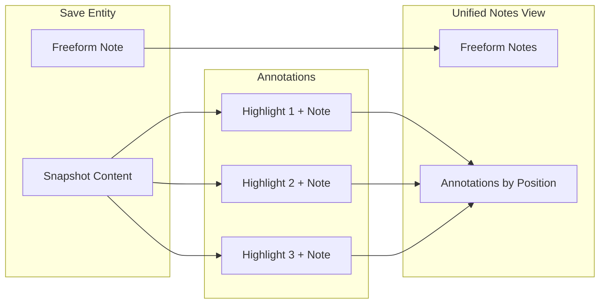

# Unified Notes + Annotations System

## Vision

Transform the notes experience from a simple text field into a rich, integrated annotation layer. Users can highlight text within snapshot content and attach notes to those highlights, while still maintaining freeform notes for general thoughts. Both are displayed in a unified "Notes" experience.



---

## 1. Data Schema

### New `saveAnnotations` Table

Add to [`convex/schema.ts`](convex/schema.ts):

```typescript
saveAnnotations: defineTable({
  saveId: v.id("saves"),
  spaceId: v.id("spaces"),
  userId: v.id("users"),
  
  // Text anchoring (resilient to minor content changes)
  highlightText: v.string(),        // Exact highlighted text
  contextBefore: v.string(),        // ~500 chars before for disambiguation
  contextAfter: v.string(),         // ~500 chars after for disambiguation
  
  // User's annotation
  note: v.string(),                 // Markdown supported
  color: v.optional(v.string()),    // "yellow" | "blue" | "green" | "pink" | null
  
  // Metadata
  createdAt: v.number(),
  updatedAt: v.number(),
})
  .index("by_saveId", ["saveId"])
  .index("by_spaceId", ["spaceId"])
  .index("by_userId", ["userId"])
```

**Cost-conscious design:**

- Separate table allows efficient batch queries
- Indexes on `saveId` for single-save fetches (most common)
- Context fields capped at ~500 chars for reliable text anchoring
- No duplication of snapshot content

---

## 2. Convex Functions

### Queries

```typescript
// Get all annotations for a save (authenticated)
getAnnotations: query({ saveId }) => Annotation[]

// Get annotations for public save
getPublicAnnotations: query({ saveId }) => Annotation[]
```

### Mutations

```typescript
// Create annotation
createAnnotation: mutation({
  saveId, highlightText, contextBefore, contextAfter, note, color?
}) => annotationId

// Update annotation note/color
updateAnnotation: mutation({ annotationId, note?, color? })

// Delete annotation
deleteAnnotation: mutation({ annotationId })
```

**Rate limiting:** Apply same limits as notes (included in save operations).

---

## 3. Web App Implementation

### A. Reader Mode Enhancement

Modify [`components/reader-mode.tsx`](apps/backpocket-web/components/reader-mode.tsx):

**Text Selection UX:**

1. User selects text in article content
2. Floating toolbar appears near selection with "Annotate" button
3. Clicking opens a mini-editor popover to write the note
4. On save, highlight appears in content with colored background

**Highlight Rendering:**

- Wrap highlighted text in `<mark>` elements with data attributes
- Subtle indicator (small dot or icon) shows annotation exists
- Click highlight to view/edit annotation

**Technical approach:**

- Use `window.getSelection()` API for text selection
- Store position using text + context (not DOM offsets)
- Re-hydrate highlights on render by finding text matches

### B. Unified Notes Panel

New component: `components/annotation-panel.tsx`

```
+------------------------------------------+
|  Notes                              [+]  |
+------------------------------------------+
|  [Freeform note editor - collapsible]    |
|  Write your thoughts...                  |
+------------------------------------------+
|  Annotations (3)                         |
+------------------------------------------+
|  [Yellow] "The key insight here..."      |
|  Your note: This contradicts the         |
|  earlier section about...                |
|  ---                                     |
|  [Blue] "Users prefer simplicity"        |
|  Your note: Reference for design doc     |
+------------------------------------------+
```

**Features:**

- Freeform notes section at top (existing editor)
- Annotations list below, ordered by appearance in content
- Click annotation to scroll to and highlight it in reader
- Edit/delete inline
- Color picker for highlight colors

### C. Visual Design (per frontend-design skill)

**Aesthetic direction: Editorial/Magazine**

- **Highlights:** Soft, paper-like highlight colors (cream yellow, soft pink, muted blue, sage green)
- **Annotation indicators:** Subtle superscript numbers or small dots in margin
- **Panel:** Clean, minimal sidebar or bottom sheet
- **Typography:** Use Fraunces for annotation quotes, DM Sans for notes
- **Micro-interactions:** 
  - Highlight fades in with subtle animation
  - Selection toolbar slides up from selection
  - Panel annotations have staggered reveal on load

---

## 4. Mobile App Implementation

### A. Highlight Mode

Modify [`app/save/[id].tsx`](apps/backpocket-mobile/app/save/[id].tsx):

**Interaction pattern:**

1. Long-press on text enters "highlight mode" (or use selection handles)
2. Selection shows floating action button with highlighter icon
3. Tap to create annotation with bottom sheet editor
4. Highlights render with colored backgrounds

**Technical approach:**

- Use `react-native-render-html` custom renderers for highlights
- Text selection via native selection or custom implementation
- Bottom sheet for annotation editing (consistent with existing patterns)

### B. Unified Notes Tab

Replace current "Note" tab with unified experience:

- Freeform note at top
- Annotations list below
- Tap annotation to scroll reader to that position

---

## 5. Public Spaces

### Visible Annotations

On public save pages ([`app/public/s/[saveId]/page.tsx`](apps/backpocket-web/app/public/s/[saveId]/page.tsx)):

- Render highlights in content (read-only)
- Show annotations in a "Marginalia" section or as hover popovers
- Display author attribution for annotations
- Creates a sense of "shared reading with commentary"

**Design consideration:** Public annotations add value and encourage engagement. Show them elegantly without overwhelming the content.

---

## 6. Implementation Phases

### Phase 1: Data Layer + Basic Web

- Schema + migrations
- Convex functions (CRUD)
- Basic highlight creation on web (selection + popover)
- Simple annotation list view

### Phase 2: Unified Notes Panel + Polish

- Unified notes component
- Highlight rendering with colors
- Click-to-scroll interaction
- Refined visual design

### Phase 3: Mobile Implementation

- Highlight mode in mobile reader
- Bottom sheet annotation editor
- Unified notes tab

### Phase 4: Public Spaces

- Public annotation rendering
- Marginalia display mode
- OG image updates (show annotation count?)

---

## 7. Cost Considerations

| Concern | Mitigation |

|---------|------------|

| Storage | Context fields capped at 500 chars; notes use markdown (compact) |

| Reads | Batch fetch with save/snapshot; indexed by saveId |

| Writes | Single mutation per annotation; debounced auto-save |

| Bandwidth | Annotations fetched separately from snapshot (lazy load option) |

**Expected impact:** Minimal. Annotations are small documents (~1.5KB avg with 500-char context fields), fetched in batches. No change to snapshot processing costs.

---

## 8. Key Files to Modify

**Backend:**

- [`convex/schema.ts`](convex/schema.ts) - Add saveAnnotations table
- New file: `convex/annotations.ts` - CRUD functions

**Web:**

- [`components/reader-mode.tsx`](apps/backpocket-web/components/reader-mode.tsx) - Add selection + highlights
- New file: `components/annotation-panel.tsx` - Unified notes view
- New file: `components/annotation-popover.tsx` - Inline editor
- [`app/app/saves/[saveId]/page.tsx`](apps/backpocket-web/app/app/saves/[saveId]/page.tsx) - Integrate panel
- [`app/public/s/[saveId]/page.tsx`](apps/backpocket-web/app/public/s/[saveId]/page.tsx) - Public annotations

**Mobile:**

- [`app/save/[id].tsx`](apps/backpocket-mobile/app/save/[id].tsx) - Highlight mode + unified notes
- New file: `components/annotation-sheet.tsx` - Bottom sheet editor

**Shared types:**

- [`packages/types/src/index.ts`](packages/types/src/index.ts) - Annotation types